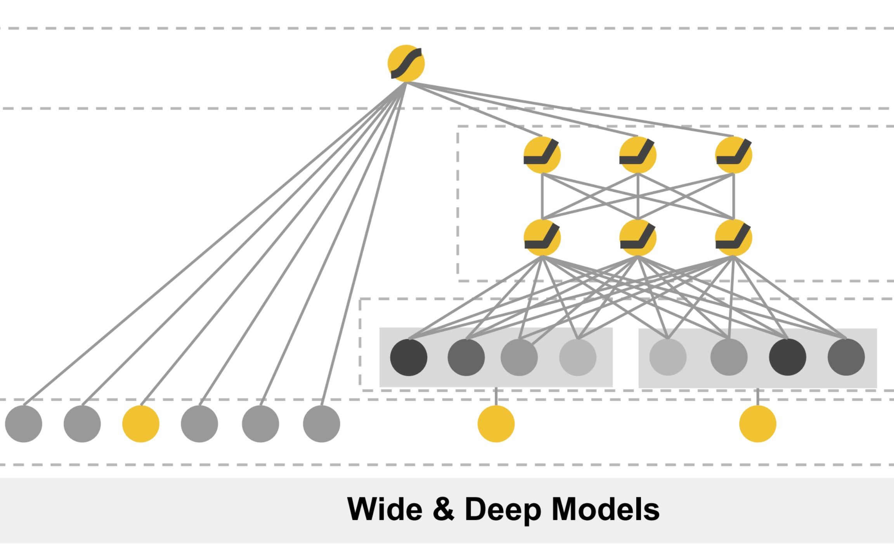

# 模型介绍

这一部分我们主要对我们框架所涉及的模型进行简答的介绍,我们的框架主要涵盖了传统的Rank模型与多任务模型,下面我们分别对这两类模型进行介绍

## Rank 模型

这里我们收录了很多经典的基于特征交叉的Rank模型,至于最近的SOTA的Rank模型我们目前还没有进行开发,后续会开发更多的SOTA模型

### Wide&Deep

#### Intorduction

**论文链接**：[Wide & Deep Learning for Recommender Systems](https://arxiv.org/pdf/1606.07792) \
**Abstract**:Generalized linear models with nonlinear feature transfor- mations are widely used for large-scale regression and clas- sification problems with sparse inputs. Memorization of fea- ture interactions through a wide set of cross-product feature transformations are effective and interpretable, while gener- alization requires more feature engineering effort. With less feature engineering, deep neural networks can generalize bet- ter to unseen feature combinations through low-dimensional dense embeddings learned for the sparse features. However, deep neural networks with embeddings can over-generalize and recommend less relevant items when the user-item inter- actions are sparse and high-rank. In this paper, we present Wide & Deep learning—jointly trained wide linear models and deep neural networks—to combine the benefits of mem- orization and generalization for recommender systems. We productionized and evaluated the system on Google Play, a commercial mobile app store with over one billion active users and over one million apps. Online experiment results show that Wide & Deep significantly increased app acquisi- tions compared with wide-only and deep-only models. We have also open-sourced our implementation in TensorFlow.

#### pangu代码实现解析

我们从wide&deep的模型结构可以看出wide&deep模型主要由两部分组成，第一部分就是wide部分，第二部分就是deep部分，其最终的输出结果是由wide部分的输出与deep部分的输出的和构成的，
我们下面分别来看在pangu中wide部分与deep部分的实现\
对于wide部分，就直接将输入的数据送入LR层即可
```python
# Wide
wide_logit = self.lr(data)  # Batch,1
```
对于deep部分，需要首先获得离散特征的embedding向量，然后将其拼接起来之后在flatten，这样获得的维度是[batch,num_sparse * embedding_dim]的tensor，
然后将这个tensor与连续特征进行拼接，将其送入dnn中即可完成deep部分的建模
```python
# Deep
sparse_emb = self.embedding_layer(data)
sparse_emb = sparse_emb.flatten(start_dim=1) #batch,num_sparse * embedding_dim
dense_input = get_linear_input(self.enc_dict, data)
dnn_input = torch.cat([sparse_emb, dense_input], dim=1)  # Batch,num_sparse_fea*embedding_dim+num_dense
deep_logit = self.dnn(dnn_input)
```
在获取了wide与deep部分的输出之后，将这两部分求和在经过sigmoid激活得到wide&deep模型的最终输出
```python
# Wide+Deep
y_pred = (wide_logit + deep_logit).sigmoid()
```
更多的细节见[wdl.py](https://github.com/HaSai666/rec_pangu/blob/main/rec_pangu/models/ranking/wdl.py)

#### 实验记录
记录一些这个模型的调参经验...这个部分可加可不加

#### 评价
Rank模型在深度学习上进行尝试的里程碑的模型，模型结构简单有效，值得学习！

### DeepFM

### FiBiNet

### NFM

### AFM

### AutoInt

### CCPM

### xDeepFM

### DCN

### LR

### FM


## 多任务模型

### ShareBottom

### OMOE

### MMOE

### MLMMOE

### ESSM

### AITM

